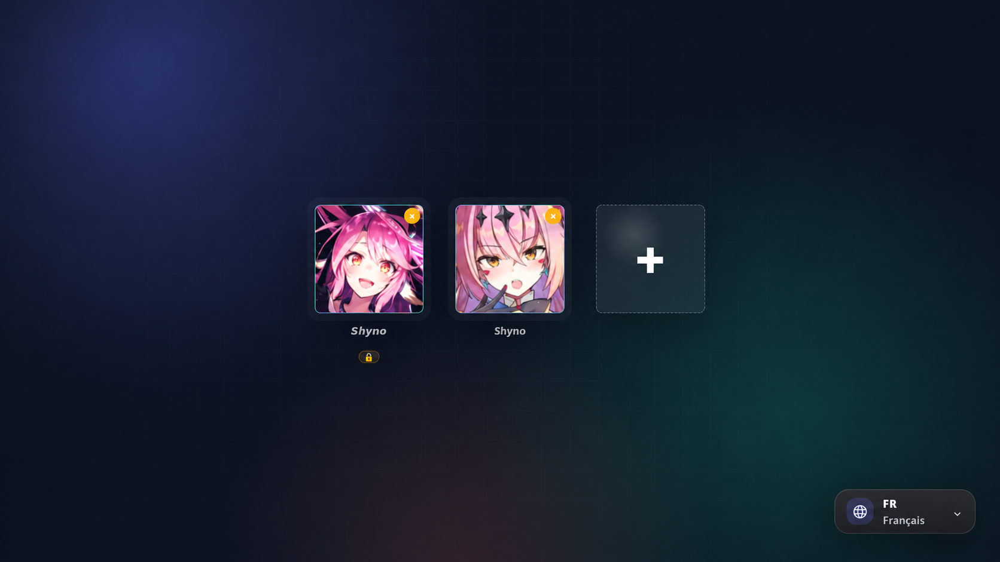
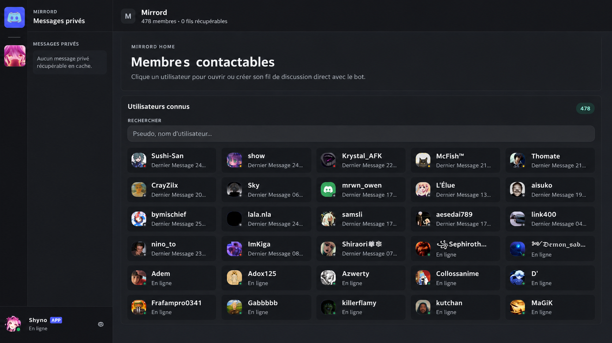
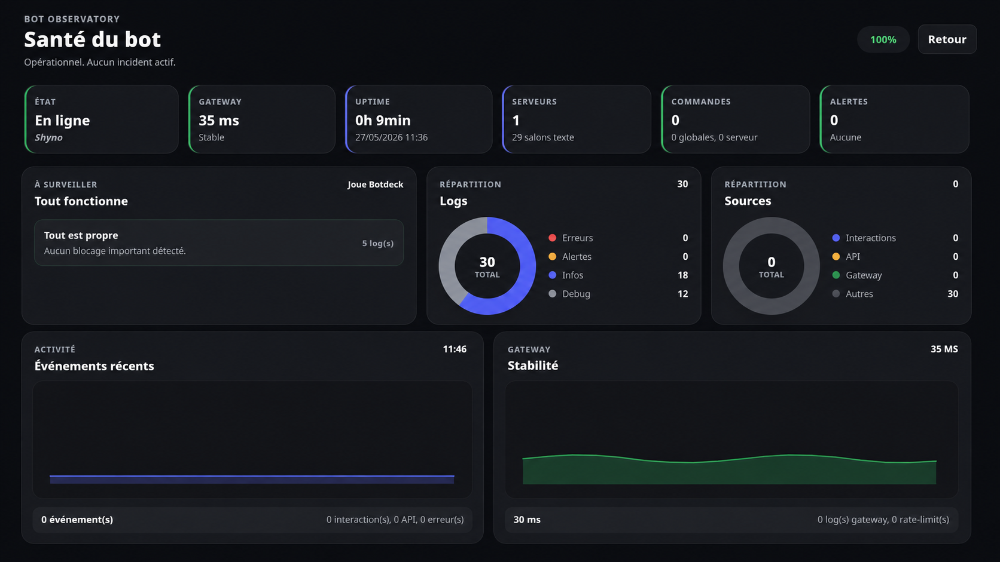
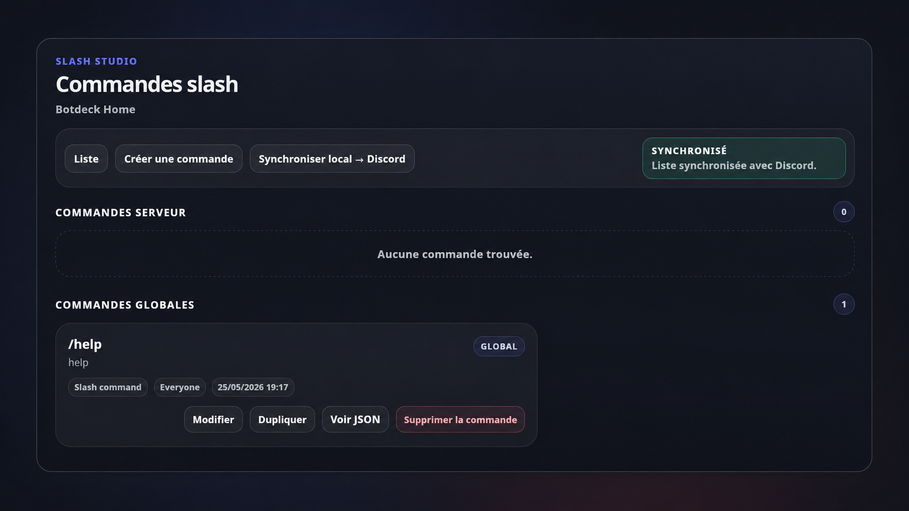

# Botdeck

<p align="center">
  
</p>

<p align="center">
  
  
  
</p>

Botdeck is a local desktop app for managing Discord bots from one clean interface.

It helps you create bots, manage servers, edit messages, build embeds, configure commands, monitor activity, and keep the runtime local to your machine.

> Status: public beta. Test Botdeck on a disposable Discord server before using it on an important server.

## Preview

| Bot setup | Workspace |
| --- | --- |
|  |  |

| Runtime health | Slash command studio |
| --- | --- |
|  |  |

## Main features

- Manage multiple Discord bots locally.
- Use a Discord-style workspace.
- Send, edit, and inspect messages.
- Create embeds with live preview.
- Build and test slash commands.
- Configure templates and automations.
- Inspect channels, roles, permissions, and server state.
- Search indexed messages with SQLite.
- Monitor runtime health.
- Configure local HTTPS/TLS from the app.
- Use read-only mode for safer inspection.

## Security highlights

- Discord bot tokens are encrypted at rest.
- Local API actions are protected against cross-site requests.
- WebSocket access requires a local auth token.
- WebSocket origins are checked.
- HTTPS/TLS can be generated or imported locally.
- Security headers and CSP are enabled.
- Sensitive actions are rate-limited.
- Read-only protections are enforced server-side.
- Security events are written to `.botdeck/audit/security-audit.jsonl`.

More details: [docs/SECURITY.md](docs/SECURITY.md).

## Requirements

- Node.js `24.17.0` recommended.
- npm `>=10 <12`.
- A Discord application with a bot account.
- A Discord test server.

Botdeck supports Node.js `>=22.16.0 <25`.

## Quick start

Install dependencies:

```shell
npm ci
```

Generate Prisma client and apply local database migrations:

```shell
npm --prefix apps/web run db:generate
npm run db:migrate
```

Start development mode:

```shell
npm run dev
```

Open the web UI:

```text
http://localhost:3000
```

Start the desktop app:

```shell
npm run app
```

## Checks before release

```shell
npm run check
npm run build
npm run audit:prod
npm run package:check
```

Useful packaging commands:

```shell
npm run build-win
npm run build-lin
npm run build-mac
npm run build-all
```

## Documentation

- [Installation](docs/INSTALL.md)
- [Security](docs/SECURITY.md)
- [Architecture](docs/ARCHITECTURE.md)
- [Release process](docs/RELEASE.md)
- [Changelog](CHANGELOG.md)
- [Contributing](CONTRIBUTING.md)

## License

Copyright © 2026 [Macxzew](https://github.com/Macxzew).

Distributed under the MIT license.
